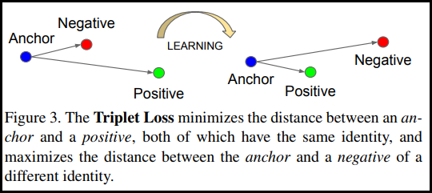
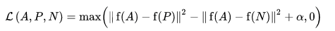
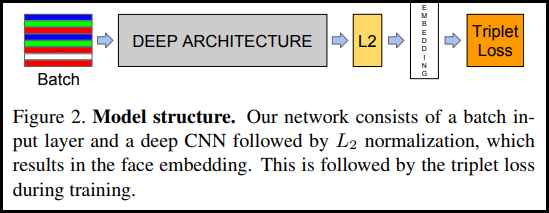
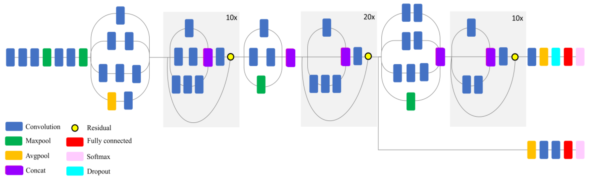

# README

## Introduce

Implement of Face Recognition

### Face Detection

using `MTCNN` to detect faces in given image

the following example illustrates the ease of use of this package:

```python
import cv2
from mtcnn import MTCNN

img = cv2.cvtColor(cv2.imread("example.jpg"), cv2.COLOR_BGR2RGB)
detector = MTCNN()
detector.detect_faces(img)
```

outputs:

```bash
[
    {
        'box': [277, 90, 48, 63],
        'keypoints':
        {
            'nose': (303, 131),
            'mouth_right': (313, 141),
            'right_eye': (314, 114),
            'left_eye': (291, 117),
            'mouth_left': (296, 143)
        },
        'confidence': 0.99851983785629272
    }
]
```

### TripletLoss

As first introduced in the FaceNet paper, TripletLoss is a loss function that trains a neural network to closely embed features of the same class while maximizing the distance between embeddings of different classes. To do this an anchor is chosen along with one negative and one positive sample.



**The loss function is described as a Euclidean distance function:**



Where A is our anchor input, P is the positive sample input, N is the negative sample input, and alpha is some margin we use to specify when a triplet has become too "easy" and we no longer want to adjust the weights from it.

### SemiHard Online Learning

As shown in the paper, the best results are from triplets known as "Semi-Hard". These are defined as triplets where the negative is farther from the anchor than the positive, but still produces a positive loss. To efficiently find these triplets we utilize online learning and only train from the Semi-Hard examples in each batch.

**Build the Model:**



### InceptionResNetV2



## Dataset

- [5-celebrity-faces-dataset](https://www.kaggle.com/dansbecker/5-celebrity-faces-dataset)

## Library

- [matplotlib](https://pypi.org/project/matplotlib/)
- [mtcnn](https://pypi.org/project/mtcnn/)
- [opencv-python](https://pypi.org/project/opencv-python/)
- [sklearn](https://pypi.org/project/sklearn/)
- [tensorflow](https://pypi.org/project/tensorflow/)
- [tensorflow-addons](https://pypi.org/project/tensorflow-addons/)

## Reference

- [TensorFlow Addons Losses: TripletSemiHardLoss](https://www.tensorflow.org/addons/tutorials/losses_triplet)
- [How to Develop a Face Recognition System Using FaceNet in Keras](https://machinelearningmastery.com/how-to-develop-a-face-recognition-system-using-facenet-in-keras-and-an-svm-classifier/)
